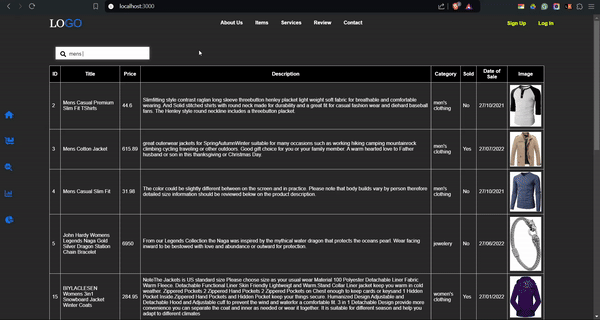

# Eesha-Patro-MERN-stack-Assignment

This project is a MERN stack application that integrates a third-party API to manage product transactions. It initializes a database with seed data fetched from the provided API and offers a set of RESTful APIs to facilitate the retrieval and manipulation of transaction data. Users can filter transactions by month, search through product titles, descriptions, and prices, and visualize statistics through bar and pie charts.

## Features
- **Database Initialization**: Fetch and seed data from a third-party API.
- **Transaction Listing**: Display transactions in a table format with search and pagination functionality.
- **Statistics API**: Retrieve total sales amount, total sold items, and total unsold items for a selected month.
- **Charts**: Visualize data with a bar chart representing price ranges and a pie chart showing unique categories.

## Product Rendering and Search Functionality

The application efficiently fetches and renders data from a third-party API, presenting it in a user-friendly table format. Users can easily view and interact with the displayed information, and a robust search functionality allows them to filter data in real-time. By entering search terms, users can quickly narrow down results, while clearing the input reverts to displaying the full dataset. This combination of data rendering and search capability enhances the application's usability, making it easier for users to locate the information they need efficiently.




### Example API Response

The application utilizes a JSON response from the API to populate the table. The search functionality updates the displayed results in real-time, providing users with a seamless experience in finding relevant information.


## Statistics, Bar Chart, and Pie Chart

The application provides insightful statistics and visual representations of transaction data through a comprehensive statistics section, bar chart, and pie chart. Users can select a month from the dropdown menu, and the application will fetch and display relevant data for that selected month. The **Transaction Statistics** feature showcases key metrics, including the total amount of sales, the total number of sold items, and the total number of items that were not sold. This information is presented in an easily digestible format, allowing users to quickly assess performance for the selected month.


Additionally, the **Transactions Bar Chart** visually represents the price ranges and the corresponding number of items within those ranges for the selected month, regardless of the year. This bar chart enables users to understand pricing distribution and identify trends at a glance. 

Furthermore, a **Pie Chart** is included to illustrate the breakdown of unique categories and the number of items within each category for the selected month. By leveraging the API, these visualizations and statistics enhance the user's ability to analyze and interpret transaction data effectively, providing valuable insights for decision-making.


## Technologies Used
- **Frontend**: React, Axios
- **Backend**: Node.js, Express, MongoDB
  

## Setup Instructions

```bash
git clone https://github.com/Amanwaikar13/Eesha-Patro-MERN-stack-Assignment.git
cd Eesha-Patro-MERN-stack-Assignment
cd backend
npm install
npm start
cd ../frontend
npm install
npm start

